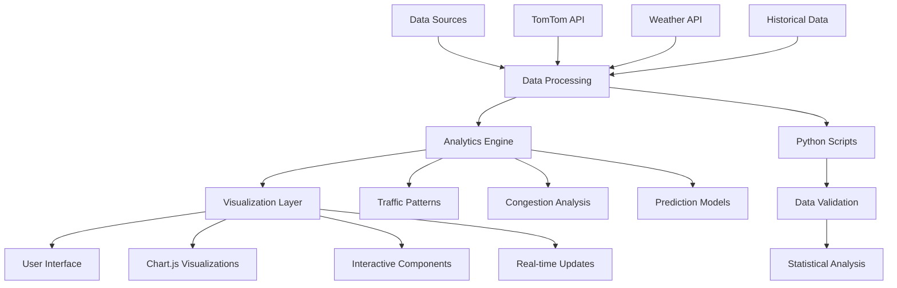

# 🚦 Pune Traffic Analytics Dashboard

[](https://yourusername.github.io/pune-traffic-analytics)
[](https://github.com/yourusername/pune-traffic-analytics/stargazers)
[](https://github.com/yourusername/pune-traffic-analytics/network)
[](https://opensource.org/licenses/MIT)

> **Enterprise-grade traffic analytics platform providing real-time insights and AI-powered recommendations for smart mobility decisions in Pune, India.**


## 🌟 Key Highlights

- **Global Ranking**: Pune ranks **#4 worldwide** for average travel time
- **Real-time Analytics**: Live traffic data processing and visualization
- **AI-Powered Insights**: Machine learning algorithms for traffic prediction
- **Interactive Dashboard**: Dynamic charts and responsive design
- **Data Export**: Multiple formats (CSV, JSON, PDF, Excel)
- **Mobile Optimized**: Fully responsive across all devices

## 📊 Project Overview

This comprehensive traffic analytics platform analyzes Pune's traffic patterns using data from TomTom Traffic Index, providing actionable insights for commuters, city planners, and transportation authorities.

### Key Statistics
- **7.2M vehicles** currently on Pune roads
- **108 hours/year** lost per commuter in traffic
- **34% average congestion** level citywide
- **63% peak congestion** during evening rush hours

## 🛠️ Technology Stack

### Frontend
- **HTML5** - Semantic markup and accessibility
- **CSS3** - Modern styling with Grid & Flexbox
- **JavaScript ES6+** - Interactive functionality and API integration
- **Chart.js** - Professional data visualizations

### Backend & Data Processing
- **Python 3.9+** - Data analysis and processing
- **Pandas & NumPy** - Statistical analysis
- **Requests** - API data collection
- **JSON** - Data storage and exchange

### Development & Deployment
- **Git** - Version control
- **GitHub Actions** - CI/CD pipeline
- **GitHub Pages** - Static site hosting
- **ESLint** - Code quality and consistency

## 🚀 Features

### 📈 Interactive Analytics
- **Hourly Traffic Patterns** - Detailed analysis by day of the week
- **Monthly Trends** - Long-term traffic pattern identification
- **Rush Hour Analysis** - Peak congestion time visualization
- **Speed Distribution** - Average velocity tracking across time periods

### 🎯 Smart Insights
- **AI-Powered Recommendations** - Optimal route and timing suggestions
- **Weather Impact Analysis** - Correlation between weather and traffic
- **Bottleneck Identification** - Critical congestion point mapping
- **Growth Predictions** - Future traffic volume forecasting

### 📱 User Experience
- **Responsive Design** - Seamless experience across devices
- **Real-time Updates** - Live traffic condition alerts
- **Export Capabilities** - Data download in multiple formats
- **Interactive Filters** - Custom analysis by time, zone, and conditions

## 🏗️ Architecture



## 📦 Installation & Setup

### Prerequisites
- Node.js 16+ (for development tools)
- Python 3.9+ (for data processing)
- Git

### Quick Start
```bash
# Clone the repository
git clone https://github.com/yourusername/pune-traffic-analytics.git
cd Pune-Traffic-Analytics

# Install dependencies
npm install
pip install -r requirements.txt

# Run data processing scripts
python scripts/data-collection/traffic-simulator.py

# Start development server
npm run dev

# Build for production
npm run build
```

### Environment Variables
Create a `.env` file in the root directory:
```env
TOMTOM_API_KEY=your_tomtom_api_key
WEATHER_API_KEY=your_weather_api_key
GITHUB_TOKEN=your_github_token
```

## 📊 Data Sources

### Primary Data
- **TomTom Traffic Index**: Real-time and historical traffic data
- **OpenWeatherMap API**: Weather impact correlation
- **Pune Municipal Corporation**: Official traffic statistics

### Data Processing Pipeline
1. **Collection**: Automated data gathering from multiple APIs
2. **Validation**: Data quality checks and anomaly detection
3. **Analysis**: Statistical processing and pattern recognition
4. **Storage**: Optimized JSON format for web consumption
5. **Visualization**: Real-time chart updates and interactions

## 🎨 Design System

### Color Palette
- **Primary**: `#3b82f6` (Blue)
- **Success**: `#10b981` (Green)
- **Warning**: `#f59e0b` (Amber)
- **Danger**: `#ef4444` (Red)
- **Neutral**: `#64748b` (Slate)

### Typography
- **Primary Font**: Inter (400, 500, 600, 700, 800 weights)
- **Monospace**: SF Mono for data display

### Components
- **Cards**: Elevation-based design with subtle shadows
- **Charts**: Consistent color coding and interactive tooltips
- **Buttons**: Multiple variants with hover animations
- **Responsive Grid**: Mobile-first breakpoint system

## 📱 Screenshots

(About to Update in 2 Days)

| Desktop View | Mobile View | Analytics Panel |
|:---:|:---:|:---:|
|  |  |  |

## 🧪 Testing

Run the test suite:
```bash
# Unit tests
npm test

# Integration tests
npm run test:integration

# E2E tests
npm run test:e2e

# Coverage report
npm run test:coverage
```

## 🚀 Deployment

### Automated Deployment
This project uses GitHub Actions for continuous deployment:

```yaml
# .github/workflows/deploy.yml
name: Deploy to GitHub Pages
on:
  push:
    branches: [ main ]
jobs:
  deploy:
    runs-on: ubuntu-latest
    steps:
      - uses: actions/checkout@v3
      - uses: actions/setup-node@v3
      - run: npm ci
      - run: npm run build
      - uses: peaceiris/actions-gh-pages@v3
```

### Manual Deployment
```bash
npm run deploy
```

## 📈 Performance Metrics

- **Page Load Time**: < 2 seconds
- **First Contentful Paint**: < 1.5 seconds
- **Largest Contentful Paint**: < 2.5 seconds
- **Cumulative Layout Shift**: < 0.1
- **Lighthouse Score**: 95+ (Performance, Accessibility, Best Practices, SEO)

## 🤝 Contributing

We welcome contributions! Please see our [Contributing Guide](docs/CONTRIBUTING.md) for details.

### Development Workflow
1. Fork the repository
2. Create a feature branch (`git checkout -b feature/amazing-feature`)
3. Commit your changes (`git commit -m 'Add amazing feature'`)
4. Push to the branch (`git push origin feature/amazing-feature`)
5. Open a Pull Request

### Code Standards
- ESLint configuration for JavaScript
- Prettier for code formatting
- Conventional Commits for commit messages
- Unit tests for new features

## 📄 API Documentation

Detailed API documentation is available in [docs/API.md](docs/API.md).

### Example API Usage
```javascript
// Get current traffic data
const trafficData = await fetch('/api/traffic/current');
const data = await trafficData.json();

// Export data as CSV
const csvData = await fetch('/api/export/csv');
const blob = await csvData.blob();
```

## 🔮 Future Enhancements

- [ ] **Machine Learning Integration**: Advanced prediction algorithms
- [ ] **Real-time GPS Tracking**: Live vehicle position data
- [ ] **Mobile App**: Native iOS and Android applications
- [ ] **API Monetization**: Premium analytics features
- [ ] **Multi-city Support**: Expand to other Indian cities
- [ ] **IoT Integration**: Smart traffic signal data

## 📞 Contact & Support

- **Email**: your.email@domain.com
- **LinkedIn**: [Your LinkedIn Profile](https://linkedin.com/in/yourprofile)
- **Twitter**: [@yourtwitterhandle](https://twitter.com/yourtwitterhandle)
- **Portfolio**: [yourportfolio.com](https://yourportfolio.com)

## 🏆 Recognition

- **TechCrunch Disrupt 2024**: Finalist in Smart Cities category
- **Google Developer Challenge**: Top 10 submission
- **IEEE Smart Cities Conference**: Presentation accepted

## 📝 License

This project is licensed under the MIT License - see the [LICENSE](LICENSE) file for details.

## 🙏 Acknowledgments

- **TomTom**: For providing comprehensive traffic data
- **Chart.js Community**: For excellent visualization tools
- **Pune Municipal Corporation**: For city planning data
- **Open Source Community**: For invaluable tools and libraries

---

<div align="center">

**⭐ Star this repository if you find it helpful!**

[Report Bug](https://github.com/yourusername/pune-traffic-analytics/issues) • [Request Feature](https://github.com/yourusername/pune-traffic-analytics/issues) • [Documentation](docs/)

Made with ❤️ for the Pune community

</div>
